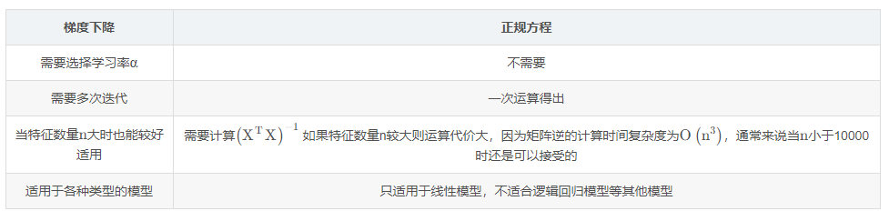

## K近邻算法

### K近邻算法简介

- 定义
  - 通过你的“邻居”来判断你属于哪个类别
- 如何计算你到你邻居的距离
  - 一般都是使用欧氏距离

### K近邻算法API

- sklearn
  - 优势
    - 文档多，且规范
    - 包含的算法多
    - 实现起来容易
- sklearn 中包含的内容
  - 分类、聚类、回归
  - 特征工程
  - 模型选择、调优
- API
  - sklearn.neighbors.KNeighborsClassifier()
    - n_neighbors  -- 选定的参考值
- 机器学习中实现的过程
  - 实例化一个估计器
  - 使用fit 方法进行训练

### 距离度量

- 欧式距离
  - 通过距离的平方值，进行计算
- 曼哈顿距离
  - 通过距离的绝对值，进行计算
- 切比雪夫距离
  - 维度的最大值，进行计算
- 闵可夫斯基距离
  - 当 p=1 时，就是曼哈顿距离
  - 当 p=2 时，就是欧式距离
  - 当 p无穷大时，就是切比雪夫距离

> 小结：前面的四个距离公式都是把单位相同看待，所以计算过程不是很科学

- 标准化欧氏距离
  - 在计算过程中添加了标准差，对量纲数据进行处理
- 余弦距离
  - 通过 cos 思想完成
- 汉明距离
  - 一个字符串到另一个字符串需要变换几个字母，进行统计
- 杰卡德距离
  - 通过交并集，进行统计
- 马氏距离
  - 通过样本分布，进行计算

### K值选择

- 过小
  - 容易受到异常点的影响
  - 过拟合
- 过大
  - 容易受到样本均衡问题的影响
  - 欠拟合
- 拓展
  - 近似误差  --  过拟合
  - 估计误差好， 才是真的好

### K近邻算法总结

- 优点
  - 简单有效
  - 重新训练代价低
  - 适合类域交叉样本
  - 适合大样本自动分类
- 缺点
  - 惰性学习
  - 类别评分不是很规范
  - 输出，可解释性不强
  - 对不均衡样本不擅长
    - 样本不均衡  -- 收集到的数据，每个类别占比严重失衡
  - 计算量较大

### 交叉验证 和 网格搜索

- 交叉验证
  - 定义 -- 将拿到的训练数据，分为训练集和验证集
    - 几折交叉验证
  - 分割方式
    - 训练集  -- 训练+验证
    - 测试集  -- 测试
  - 为什么需要交叉验证
    - 为了让被评估的模型，更加的准确可信
    - 交叉验证不能提高模型的准确率
- 网格搜索
  - 超参数
    - sklearn中，需要手动指定的参数，叫做超参数
  - 网格搜索 -- 就是把超参数的值，通过字典的形式传递进去，然后选择最优值
- API
  - sklearn.model_selection.GridSearchCV
    - estimator  --  选择哪个训练模型
    - param_grid  -- 需要传递的超参数
    - cv  -- 几折交叉验证

## 线性回归

### 线性回归简介

- 定义

  - 利用线性回归方程（函数）对一个或者多个自变量（特征值）和因变量（目标值）之间关系进行建模的一种分析方式
- 分类

  - 线性关系
  - 非线性关系

### 线性回归的损失和优化

- 损失

  - 最小二乘法
- 优化

  - 正规方程
  - 梯度下降
- 正规方程  -- 一蹴而就

  - 利用矩阵的逆，转置进行一步求解
  - 只适合样本和特征值较少的情况
- 梯度下降法

  - 举例
    - 山  --  可微分函数
    - 山底  --  函数的最小值
  - 梯度的概念
    - 单变量  --  切线
    - 多变量  --  向量
  - 梯度下降法中关注的两个参数
    - α -- 步长
      - 步长太小  --  下山太慢
      - 步长太大  --   容易跳过极值点
    - 为什么梯度要加一个负号
      - 梯度方向是上升最快的方向，负号就是下降最快的方向
- 梯度下降 和 正规方程对比

  
- 选择

  - 小规模数据
    - LinearRegression （不能解决拟合问题）-- 岭回归
  - 大规模数据
    - SGDRegression

### 梯度下降法

- 全梯度下降法 FG
  - 在进行计算的时候，计算所有样本的误差平均值，作为目标函数
- 随机梯度下降法 SG
  - 每次只选择一个样本进行考核
- 小批量梯度下降法 mini-batch
  - 选择一部分样本进行考核
- 随机平均梯度下降法
  - 会给每一个样本都维护一个平均值，后期计算的时候，参考这个平均值

### API

- 正规方程
  - sklearn.linear_model.LinearRegression
- 梯度下降
  - sklearn.linear_model.SGDRegression

### 欠拟合和过拟合

- 欠拟合
  - 在训练集上表现不好，在测试集上表现不好
  - 解决方法
    - 添加其他特征项
    - 添加多项式特征
- 过拟合
  - 在训练集上表现好，在测试集上表现不好
  - 解决方法
    - 重新清洗数据集
    - 增大数据的训练量
    - 正则化
    - 减少特征维度
- 正则化
  - 通过限制高次项的系数，防止过拟合
    - L1正则化  --  直接将高次项的系数变为0
      - Lasso 回归
    - L2正则化  --  把高次项的系数变成特别小的值
      - 岭回归
